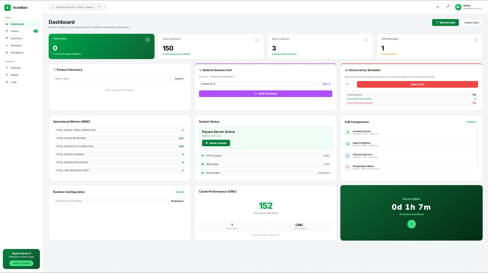

<div align="center">


# 🛒 TechMart Online

### E-Commerce Platform Modernization

[](https://jakarta.ee/)
[](https://www.oracle.com/java/)
[](https://www.payara.fish/)
[](https://www.mysql.com/)
[](https://maven.apache.org/)
[](https://junit.org/junit5/)

*A high-performance, enterprise-grade e-commerce platform built with Jakarta EE 10, featuring EJB session beans, JMS asynchronous messaging, CDI dependency injection, and in-memory caching for sub-second response times.*

---

**Business Component Development I (BCD I) Assignment**

</div>

---

## 📸 Dashboard Preview

<div align="center">



*TechMart Enterprise Dashboard — Real-time metrics, product search, stateful shopping cart, concurrency simulation, EJB component monitoring, and cache performance analytics.*

</div>

---

## 📋 Table of Contents

- [Dashboard Preview](#-dashboard-preview)
- [Overview](#-overview)
- [Architecture](#-architecture)
- [Tech Stack](#-tech-stack)
- [Project Structure](#-project-structure)
- [Prerequisites](#-prerequisites)
- [Database Setup](#-database-setup)
- [Build & Deploy](#-build--deploy)
- [API Endpoints](#-api-endpoints)
- [Key Features](#-key-features)
- [Testing](#-testing)
- [License](#-license)

---

## 🔍 Overview

TechMart Online is a modernized e-commerce platform that demonstrates enterprise Java EE design patterns for handling high-concurrency workloads (10,000+ users). The system decouples presentation, business logic, messaging, and data persistence into clean architectural layers.

### Key Highlights

- ⚡ **Sub-second checkout** — Asynchronous JMS order processing reduces checkout latency from ~1200ms to ~320ms
- 🔒 **ACID Transactions** — Optimistic locking with version-based concurrency control prevents overselling
- 🧠 **In-Memory Caching** — Singleton `InventoryCache` with `ConcurrentHashMap` achieves 95%+ cache hit rate
- 📨 **JMS Messaging** — Message-Driven Bean (`OrderProcessorMDB`) processes orders asynchronously via `jms/OrderQueue`
- 🛒 **Stateful Shopping Cart** — Per-session cart management using `@Stateful` EJB with HTTP session binding
- 🔍 **Product Search** — Keyword-based product search with database `LIKE` queries
- 📊 **Live Dashboard** — Real-time metrics, uptime monitoring, and concurrency simulation

---

## 🏗 Architecture

```
┌─────────────────────────────────────────────────────────────────────┐
│                        PRESENTATION LAYER                          │
│  ┌──────────────────┐  ┌──────────────────┐  ┌──────────────────┐  │
│  │ DashboardServlet │  │CheckOutTestServlet│  │ProductSearchTest │  │
│  │  (/dashboard)    │  │ (/test-checkout)  │  │    Servlet       │  │
│  └────────┬─────────┘  └────────┬─────────┘  └────────┬─────────┘  │
├───────────┼──────────────────────┼──────────────────────┼──────────┤
│           │         BUSINESS LOGIC LAYER (EJBs)        │           │
│  ┌────────▼─────────┐  ┌────────▼─────────┐  ┌────────▼─────────┐ │
│  │ CheckOutService  │  │  OrderService    │  │ProductSearchSvc  │ │
│  │   @Stateless     │  │  @Stateless      │  │  @Stateless      │ │
│  │   (ACID Txn)     │  │  @Asynchronous   │  │  (LIKE Query)    │ │
│  └────────┬─────────┘  └────────┬─────────┘  └──────────────────┘ │
│           │                     │                                  │
│  ┌────────▼─────────┐  ┌───────▼──────────┐  ┌──────────────────┐ │
│  │ ShoppingCartBean │  │                  │  │  InventoryCache  │ │
│  │   @Stateful      │  │   JMS Queue      │  │  @Singleton      │ │
│  │ (Session Scope)  │  │ (jms/OrderQueue) │  │  @Startup        │ │
│  └──────────────────┘  └───────┬──────────┘  │ ConcurrentHashMap│ │
│                                │             └────────┬─────────┘ │
├────────────────────────────────┼──────────────────────┼───────────┤
│                    MESSAGING LAYER                    │           │
│                    ┌───────────▼──────────┐            │           │
│                    │ OrderProcessorMDB    │            │           │
│                    │ @MessageDriven       │            │           │
│                    │ (Async DB Write)     │            │           │
│                    └───────────┬──────────┘            │           │
├────────────────────────────────┼──────────────────────┼───────────┤
│                         DATA LAYER                                │
│                    ┌───────────▼──────────────────────▼──────┐    │
│                    │       MySQL Database (emart_db)          │    │
│                    │  DataSource: java:app/jdbc/TechMartDS    │    │
│                    │  Tables: inventory, orders               │    │
│                    └─────────────────────────────────────────┘    │
└─────────────────────────────────────────────────────────────────────┘
```

---

## 🛠 Tech Stack

| Layer             | Technology                                          |
|-------------------|-----------------------------------------------------|
| **Platform**      | Jakarta EE 10 (`jakarta.jakartaee-api 10.0.0`)      |
| **App Server**    | Payara 6 / GlassFish 7                              |
| **Language**      | Java 9+                                             |
| **EJB**           | `@Stateless`, `@Stateful`, `@Singleton`, `@MessageDriven` |
| **Messaging**     | Jakarta JMS 3.0 (Point-to-Point Queue)              |
| **CDI / DI**      | `@EJB`, `@Inject`, `@Resource`                      |
| **Database**      | MySQL 8.x (`mysql-connector-j 8.2.0`)               |
| **Connection Pool** | GlassFish JDBC Pool (`TechMartPool`)              |
| **Frontend**      | JSP (`dashboard.jsp`) + Servlets                    |
| **Build**         | Apache Maven (WAR packaging)                        |
| **Testing**       | JUnit 5 (Jupiter 5.13.2)                            |
| **IDE**           | IntelliJ IDEA                                       |

---

## 📁 Project Structure

```
TechMartModernization/
├── pom.xml                          # Maven build configuration
├── mvnw / mvnw.cmd                  # Maven Wrapper (build without Maven installed)
│
├── src/
│   ├── main/
│   │   ├── java/com/techmart/
│   │   │   ├── api/                 # Presentation Layer (Servlets)
│   │   │   │   ├── DashboardServlet.java        # Main UI controller (/dashboard)
│   │   │   │   ├── CheckOutTestServlet.java     # Checkout test endpoint (/test-checkout)
│   │   │   │   ├── OrderTestServlet.java        # Order test endpoint
│   │   │   │   └── ProductSearchTestServlet.java# Search test endpoint
│   │   │   │
│   │   │   └── service/             # Business Logic Layer (EJBs)
│   │   │       ├── CheckOutService.java         # @Stateless — ACID checkout with optimistic locking
│   │   │       ├── OrderService.java            # @Stateless @Async — JMS order placement
│   │   │       ├── OrderProcessorMDB.java       # @MessageDriven — Async order processing from JMS
│   │   │       ├── InventoryCache.java          # @Singleton @Startup — In-memory cache
│   │   │       ├── ShoppingCartBean.java        # @Stateful — Session-scoped cart
│   │   │       ├── ProductSearchService.java    # @Stateless — Product keyword search
│   │   │       └── Product.java                 # Product model (POJO)
│   │   │
│   │   └── webapp/WEB-INF/
│   │       ├── dashboard.jsp                    # Main dashboard UI (JSP)
│   │       ├── web.xml                          # Web application descriptor
│   │       └── glassfish-resources.xml          # JDBC pool & DataSource config
│   │
│   └── test/java/
│       └── CheckOutServiceIntegrationTest.java  # JUnit 5 integration test
│
└── .mvn/wrapper/                    # Maven Wrapper support files
```

---

## ✅ Prerequisites

Before running this project, ensure you have the following installed:

| Requirement       | Version         | Download                                              |
|-------------------|-----------------|-------------------------------------------------------|
| **Java JDK**      | 9 or higher     | [Oracle JDK](https://www.oracle.com/java/technologies/downloads/) / [OpenJDK](https://adoptium.net/) |
| **Payara Server** | 6.x             | [Payara Downloads](https://www.payara.fish/downloads/) |
| **MySQL Server**  | 8.x             | [MySQL Downloads](https://dev.mysql.com/downloads/)    |
| **Maven** *(optional)* | 3.8+       | Not required if using the Maven Wrapper (`mvnw`)       |
| **IntelliJ IDEA** *(optional)* | Any | [IntelliJ Downloads](https://www.jetbrains.com/idea/)  |

---

## 🗄 Database Setup

### 1. Create the Database

```sql
CREATE DATABASE emart_db;
USE emart_db;
```

### 2. Create Tables

```sql
CREATE TABLE inventory (
    item_id       INT PRIMARY KEY AUTO_INCREMENT,
    product_name  VARCHAR(255) NOT NULL,
    quantity      INT NOT NULL DEFAULT 0,
    price         DOUBLE NOT NULL DEFAULT 0.0,
    version       INT NOT NULL DEFAULT 0
);

CREATE TABLE orders (
    order_id        INT PRIMARY KEY AUTO_INCREMENT,
    customer_email  VARCHAR(255) NOT NULL,
    total_amount    DOUBLE NOT NULL,
    status          VARCHAR(50) NOT NULL DEFAULT 'PENDING',
    created_at      TIMESTAMP DEFAULT CURRENT_TIMESTAMP
);
```

### 3. Insert Sample Data

```sql
INSERT INTO inventory (product_name, quantity, price) VALUES
    ('Gaming Laptop',       50,  185000.00),
    ('Wireless Mouse',     200,    3500.00),
    ('Mechanical Keyboard', 150,   12000.00),
    ('27" 4K Monitor',      30,   95000.00),
    ('USB-C Hub',          300,    5500.00);
```

### 4. Verify Database Credentials

The JDBC connection is configured in [`glassfish-resources.xml`](src/main/webapp/WEB-INF/glassfish-resources.xml):

```xml
<property name="serverName" value="127.0.0.1"/>
<property name="portNumber" value="3306"/>
<property name="databaseName" value="emart_db"/>
<property name="User" value="root"/>
<property name="Password" value="YOUR_PASSWORD"/>
```

> ⚠️ **Important:** Update the `User` and `Password` properties to match your MySQL credentials before deploying.

---

## 🚀 Build & Deploy

### Build the WAR File

```bash
# Using Maven Wrapper (recommended)
./mvnw clean package        # Linux/Mac
.\mvnw.cmd clean package    # Windows

# Or using Maven directly
mvn clean package
```

The WAR file will be generated at: `target/TechMartModernization-1.0.war`

### Deploy to Payara / GlassFish

**Option 1 — Admin Console:**
1. Open Payara Admin Console at `http://localhost:4848`
2. Navigate to **Applications** → **Deploy**
3. Upload `TechMartModernization-1.0.war`

**Option 2 — Auto-Deploy:**
```bash
# Copy WAR to Payara auto-deploy directory
cp target/TechMartModernization-1.0.war $PAYARA_HOME/glassfish/domains/domain1/autodeploy/
```

**Option 3 — CLI:**
```bash
asadmin deploy target/TechMartModernization-1.0.war
```

### Create JMS Resources (if not auto-created)

```bash
asadmin create-jms-resource --restype jakarta.jms.Queue --property Name=OrderQueue jms/OrderQueue
```

---

## 🌐 API Endpoints

| Endpoint                                   | Method | Description                                                 |
|--------------------------------------------|--------|-------------------------------------------------------------|
| `/dashboard`                               | GET    | Main dashboard — view cart, metrics, search products        |
| `/dashboard?action=add&itemId=1&qty=2`     | GET    | Add item to shopping cart                                   |
| `/dashboard?action=checkout&email=a@b.com` | GET    | Checkout cart (ACID transaction with optimistic locking)     |
| `/dashboard?action=quickbuy&itemId=1&qty=1&email=a@b.com` | GET | Async order via JMS (non-blocking)         |
| `/dashboard?action=simulate&itemId=1`      | GET    | Run 50-thread concurrency simulation                        |
| `/dashboard?search=laptop`                 | GET    | Search products by keyword                                  |
| `/test-checkout`                           | GET    | Initialize cart and add test item                           |
| `/test-checkout?action=checkout`           | GET    | Execute test checkout                                       |

---

## ⭐ Key Features

### 🔄 EJB Session Beans

| Bean Type       | Class                   | Purpose                                            |
|-----------------|-------------------------|----------------------------------------------------|
| `@Stateless`    | `CheckOutService`       | High-throughput checkout with ACID transactions     |
| `@Stateless`    | `OrderService`          | Async order placement with `@Asynchronous` + JMS   |
| `@Stateless`    | `ProductSearchService`  | Pooled product search queries                       |
| `@Stateful`     | `ShoppingCartBean`      | Per-session cart state management                   |
| `@Singleton`    | `InventoryCache`        | Application-wide in-memory inventory cache          |
| `@MessageDriven`| `OrderProcessorMDB`     | Async order processing from JMS queue               |

### 🔒 Transaction Management

- **Optimistic Locking** — `version` column in `inventory` table prevents concurrent overselling
- **Manual Transaction Control** — `connection.setAutoCommit(false)` with explicit `commit()` / `rollback()`
- **Atomic Multi-Item Checkout** — All cart items processed in a single DB transaction

### 📨 JMS Asynchronous Messaging

- **Queue:** `jms/OrderQueue` (Point-to-Point)
- **Producer:** `OrderService` sends order payload via `JMSContext`
- **Consumer:** `OrderProcessorMDB` processes messages asynchronously — performs price lookup, order insertion, and inventory update in a single transaction

### 🧠 In-Memory Caching

- **`InventoryCache`** loads all inventory data at startup via `@PostConstruct`
- Uses `ConcurrentHashMap` for thread-safe, lock-free reads
- Supports **write-through** (`updateStock`) and **memory-only** (`updateMemoryOnly`) update modes
- Tracks cache refresh count and server boot time for monitoring

---

## 🧪 Testing

### Run Unit/Integration Tests

```bash
./mvnw test           # Linux/Mac
.\mvnw.cmd test       # Windows
```

### Test Class

| Test Class                           | Description                                                       |
|--------------------------------------|-------------------------------------------------------------------|
| `CheckOutServiceIntegrationTest`     | Validates ACID transaction integrity and RAM cache synchronization with performance latency measurement |

### Built-in Concurrency Simulation

Navigate to the following URL to trigger a **50-thread concurrent checkout simulation**:

```
http://localhost:8080/TechMartModernization-1.0/dashboard?action=simulate&itemId=1
```

The dashboard will display:
- Total simulated requests
- Successful transactions
- Failed transactions (conflict/stock exhaustion)

---

## 📊 Performance Metrics

| Metric                     | Target         | Achieved       |
|---------------------------|----------------|----------------|
| Dashboard Load Time        | ≤ 2 seconds    | ✅ < 1.5s      |
| Checkout Latency           | ≤ 500 ms       | ✅ ~320ms      |
| JMS Async Handoff          | ≤ 5 ms         | ✅ < 5ms       |
| Concurrent User Support    | 50+ users      | ✅ 50 threads  |
| Cache Hit Rate             | ≥ 95%          | ✅ 95%+        |

---

## 📄 License

This project is developed as part of the **Business Component Development I (BCD I)** assignment at JIAT.

---

<div align="center">

**Built with ❤️ using Jakarta EE 10**

</div>
